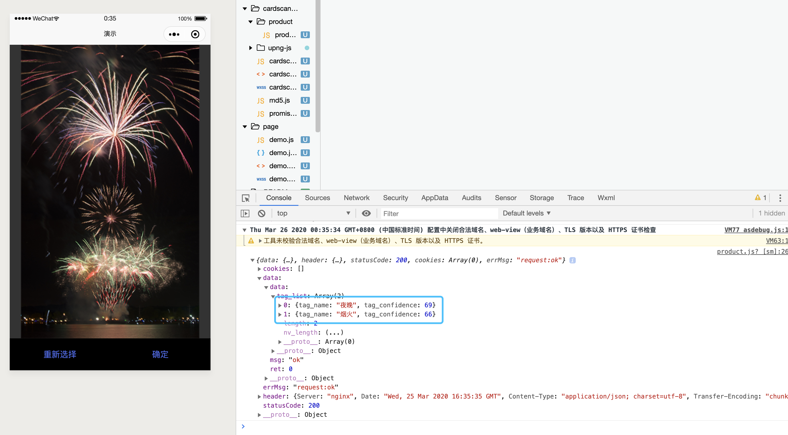

# AiWeCharApp
图片标签识别-微信小程序

### 效果图


### 图片标签识别
接口调用的是[腾讯ai开放平台](http://ai.qq.com/)的多标签识别，请将`product.js`中的`app_id、app_key`替换成自己的。  

其中签名部分计算方式如下：
```javascript
let _genRequestSign = (params) => {
  // 1. 对请求参数按字典升序排序
  params = _sortObject(params)
  // 2. 拼接键值对，value部分进行URL编码
  let paramStr = ''
  let keys = Object.keys(params)
  for (let idx in keys) {
    let key = keys[idx]
    paramStr += key + '=' + encodeURIComponent(params[key]) + '&'
  }
  // 3. 拼接key
  paramStr += 'app_key=' + app_key
  // 4. md5
  return md5.hexMD5(paramStr).toUpperCase()
}

let _sortObject = (obj) => {
  var keys = Object.keys(obj).sort()
  var newObj = {}
  for (var i = 0; i < keys.length; i++) {
    newObj[keys[i]] = obj[keys[i]]
  }
  return newObj
}
```

### 图片转Base64
接口要求将图片进行base64编码后上传，最简单的方法就是读取图片文件原始数据，然后进行base64编码，~但是微信小程序没有提供文件操作接口，只能寻求其他方法~ 
#### 更新，小程序Api中已提供文件读取的接口，通过``FileSystemManager.readFile({filePath: filePath, encoding: 'base64', success: (res) => {})``即可获取）。   

在基础库1.9.0中，微信提供了一个接口`wx.canvasGetImageData`可以获取canvas上指定区域的图像数据，所以可以将图片绘制到canvas上，再通过canvas获取图像数据，那么在小程序中将图片进行base64编码的流程如下：
1. 绘制图片至canvas
2. 获取canvas上图像数据
3. 使用开源库[UPNG](https://github.com/photopea/UPNG.js)对原始图像数据进行png编码
4. png编码后数据进行base64编码

```javascript
canvas = wx.createCanvasContext(canvasID)
// 1. 绘制图片至canvas
canvas.drawImage(imgPath, 0, 0, imgWidth, imgHeight)
// 绘制完成后执行回调，API 1.7.0
canvas.draw(false, () => {
  // 2. 获取图像数据， API 1.9.0
  wx.canvasGetImageData({
    canvasId: canvasID,
    x: 0,
    y: 0,
    width: imgWidth,
    height: imgHeight,
    success(res) {
      // 3. png编码
      let pngData = upng.encode([res.data.buffer], res.width, res.height)
      // 4. base64编码
      let base64 = wx.arrayBufferToBase64(pngData)
      // ...
    }
  })
})
```
